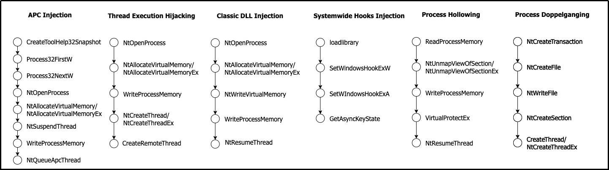

# MarauderMap-code

This repository contains materials from the paper ***An Empirical Study of Data Disruption by Ransomware Attacks*** published in ICSE'24.

We open-source the [large-scale ransomware dataset **MarauderMap**](https://github.com/m1-llie/MarauderMap), its corresponding runtime logs, analysis code, and materials for the enhancement experiment, such as benign IRPs for comparison.

The folder tree for this repository is shown below:
```
├── 1-Analysis-code
├── 2-Result-sources
└── 3-Enhancement-experiment
    ├── Benign-IRPs(100)
    ├── Ransomware(100)
    ├── Ransomware-IRPs(100)
    └── Runtime-logs(100)
```

Due to the space limit of GitHub repositories, some resources (e.g., runtime logs and IRPs) could not be fully uploaded.
Please refer to the Google Drive folder: [link](https://drive.google.com/drive/folders/19Vu7C3P8orAHzeR4KEHyivnvlWCHQuBp?usp=sharing).


## Ransomware Samples
**MarauderMap** contains 7,796 active and unique ransomware samples from 95 families.
To the best of our knowledge, this sample analysis size is an order of magnitude more than previous studies.


## Runtime Logs
After running the ransomware samples, each has a corresponding runtime log file recorded (i.e., 7,796 log files).
We remove redundant, irrelevant, or erroneous information and converted the log contents to a uniform JSON format.

The logs consist of the following six categories:
API call, file I/O, network traffic, keys modification, command execution, and service management.

All of the following ransomware threat assessments are based on these runtime logs.


## Analysis Code
We analyze how ransomware causes Denial-of-Resources attacks in the three phases of data disruption by systematically investigating the aforementioned runtime logs.

The following analysis scripts are available to help reproduce our work.
They process the JSON files folder of runtime logs and further generate statistics to help analyze the runtime behaviors of the ransomware.

To obtain information about API calls, and generate four output files "api_individual.json", "api_conclude.json", "api_all.json", "api_sequences.json":
```
python3 api-count.py [runtime_logs_folder]
```

Specifically, we investigate some data disruption procedures through the API call chain.
For example, for process injection during the data reconnaissance phase, the API call chains are as follows:



To obtain information about files，keys, and commands, and generate 13 output files "count_files.json", "count_read_files.json", "count_write_files.json", "count_delete_files.json", "count_keys.json", "count_read_keys.json", "count_write_keys.json", "count_delete_keys.json", "count_executed_commands.json", "count_resolved_apis.json", "count_mutexes.json", "count_created_services.json", "count_started_services.json":
```
python3 behavior-summary.py [runtime_logs_folder]
```

To count the number of ransomware samples that reach specific file paths, and generate the output file "certain-file-access-sample.json":
```
python3 certain-file-access-sample.py [runtime_logs_folder]
```

To count the total number of accesses to specific file paths, and generate the output file "certain_file_access_total.json":
```
python3 certain-file-access-total.py [filepath of count_files.json]
```

To calculate the running duration for each sample, and generate "duration-all-samples.json":
```
python3 duration-all-samples.py [runtime_logs_folder]
```

Finally, as described in the "Towards Better Defense" Section, we implement the Reconnaissance Detector, Tampering Detector, and Exfiltration Detector as shown in the script *maraudermap.py*.
To verify their defense effect, and generate the output files "output-1.json", "output-2.json", "output-maraudermap.json":
```
python3 maraudermap.py [runtime_logs_folder]
```


## Result Sources
All of the above output files (e.g., "api_individual.json", "output-maraudermap.json") that help analyze the ransomware samples can be found in this folder.   


## Enhancement Experiment
To further validate the usefulness of our findings,
we implement *Unveil** and *Redemption** by adding the reconnaissance detector and the tampering detector to state-of-the-art anti-ransomware tools *Unveil* and *Redemption*, respectively.
We aim to compare the detection and false positive rates of *Unveil*, *Redemption*, *Unveil**, and *Redemption**.

The 100 randomly selected ransomware samples are in the **Ransomware (100)** folder.
We also executed them in the testbed and collected their corresponding runtime logs and IRPs, as shown in the **Runtime logs (100)** and **Ransomware IRPs (100)** folders.
The benigns used for comparison are shown in the **Benign IRPs (100)** folder.

The list of benign applications is shown below:

| **Application** | **Main Capability** | **Version** | **Numbers** |
|:---------------:|:-------------------:|:-----------:|:-----------:|
|      7-zip      |  Archiver extractor |    23.01    |      17     |
|      WinRAR     |  Archiver extractor |     6.22    |      17     |
|       Edge      |       Browser       | 115.00.1901.188 |      17     |
|     Firefox     |       Browser       |   155.0.3   |      17     |
|     Notepad     |     Text editor     |    21H2     |      17     |
|     WMPlayer    |     Video player    | 12.0.19041.1288 |      15     |
|   **TOTAL**     |          -          |      -      |   **100**   |

The benign applications chosen contain executables with similar behavior patterns to ransomware and other common office software.


## Citation
```
@inproceedings{hou2024maraudermap,
  title = {An Empirical Study of Data Disruption by Ransomware Attacks},
  author = {Hou, Yiwei and Guo, Lihua and Zhou, Chijin and Xu, Yiwen and Yin, Zijing and Li, Shanshan and Sun, Chengnian and Jiang, Yu},
  booktitle = {Proceedings of the 46th IEEE/ACM International Conference on Software Engineering (ICSE'24)},
  year = {2024},
  location = {Lisbon, Portugal},
  organization={IEEE}
}
```
